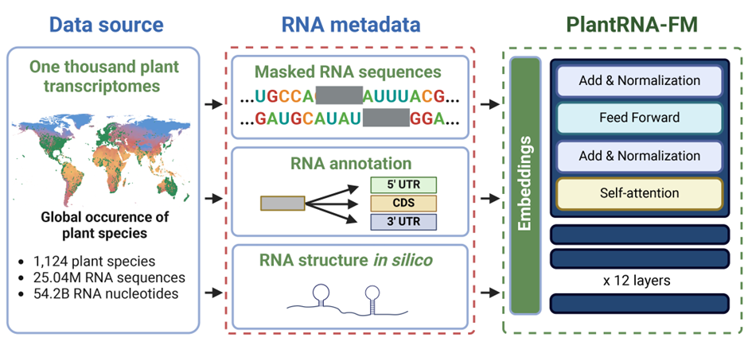
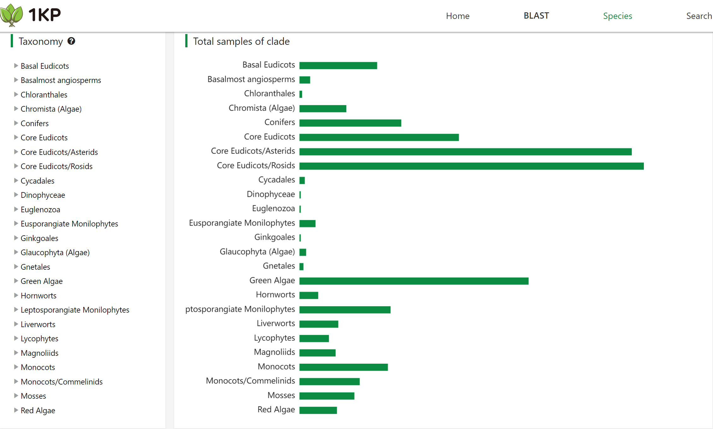

# PlantRNA-FM: An Interpretable RNA Foundation Model for Exploration Functional RNA Motifs in Plants

## Introduction
In the dynamic field of life sciences, the exploration of RNA as a fundamental element in biological processes has led to significant scientific advancements. RNA molecules, characterized by complex sequences and structures, play critical roles in plant growth, development, and adaptation to environmental changes. Recent developments in artificial intelligence, specifically foundation models (FMs), have opened new frontiers for understanding and harnessing this complexity. Building on this momentum, we introduce PlantRNA-FM, a state-of-the-art RNA foundation model tailored for plants. This model integrates both RNA sequence and structural data from an extensive compilation of plant species, enabling unprecedented accuracy in predicting RNA functions and understanding translation dynamics. By combining robust pre-training on diverse RNA data with sophisticated interpretative frameworks, PlantRNA-FM sets a new standard in RNA bioinformatics, providing deep insights into the functional significance of RNA motifs within the plant transcriptome. 

## Model Overview
The plant transcriptome data used for pre-training PlantRNA-FM was obtained from the one thousand plant transcriptomes project (1KP).
Note that modeling genomic sequences differs significantly from natural language modeling. 
For instance, while RNA sequences are one-dimensional, 
they strictly follow biological genomic patterns and depend heavily on certain structural characteristics. 
In contrast, natural language models are more resilient and can tolerate linguistic errors such as typos and grammar mistakes. 
Thus, effective RNA sequence curation is crucial to minimize the impact of noisy data and enhance modeling performance. 
Specifically, our data curation protocol is as follows. 
- Sequence truncation and filtering: We truncated RNA sequences exceeding 512 nucleotides to comply with the model's maximum length capacity and 
filtered out sequences shorter than 20 nucleotides to eliminate noise, such as RNA fragment sequences. 
- RNA secondary structure annotation: Given the significant impact of RNA secondary structures on sequence function, 
we annotated the local RNA structures of all RNA sequences using ViennaRNA (with parameters "maxBPspan"=30)25.
- Annotation of CDS and UTR sequences: After obtaining the assembled transcripts and translated RNA regions from the dataset, 
we retrieve the CDS (translated RNA), 5’ UTR, and 3’ UTR sequences (upstream and downstream of the translated RNA).


Fig. 1. Schematic overview of the Pre-training Phase of PlantRNA-FM. The pre-training dataset comprises transcriptomic sequences from 1,124 plant species, consisting of approximately 25.0M RNA sequences and 54.2B RNA bases. The green dots on the global mean temperature map represent the geographical distribution of these plant species across the world.

In this study, we developed PlantRNA-FM, a specialised language model based on the transformer architecture (Fig. 1).
PlantRNA-FM has 35 million parameters, including 12 transformer network layers, 24 attention heads, 
and an embedding dimension of 480. We applied layer normalisation and residual connections both before and after the encoder block. 
As our focus is on RNA understanding rather than generation, we only utilised the encoder component of the transformer architecture. 
PlantRNA-FM is capable of processing sequences up to 512 nucleotides in length, making it compatible with consumer-grade GPUs, 
such as the Nvidia RTX 4090, with a batch size of 16. The model was trained on four A100 GPUs over a period of three weeks, 
completing 3 epochs.

## Requirements
- Python 3.9+
- PyTorch 2.0+
- Transformers 4.38+
- pytorch-cuda 11.0+ (conda) 

## Usage
Please install the requirements and follow the instructions below to run the PlantRNA-FM model.


### Model loading
```python
from transformers import AutoModel, AutoTokenizer

model_name_or_path = "yangheng/PlantRNA-FM"

model = AutoModel.from_pretrained(model_name_or_path)
tokenizer = AutoTokenizer.from_pretrained(model_name_or_path)
```

### Inference
```python
rna_sequence = 'GCCGACUUAGCUCAGU<mask>GGGAGAGCGUUAGACUGAAGAUCUAAAGGUCCCUGGUUCGAUCCCGGGAGUCGGCACCA'

inputs = tokenizer(rna_sequence, return_tensors="pt")
outputs = model(**inputs)
print(outputs.last_hidden_state)

```


## Pretraining Data
The model was pre-trained on a large-scale dataset, a.k.a., 1KP or OneKP, of RNA sequences from 1,124 plant species. 
This database is open access at NCBI. Please find more details at [OneKP](https://db.cngb.org/onekp/)



The taxonomy distribution of the 1KP dataset. The bar chart shows the number of species in each taxonomic group.

## Copyright
PlantRNA-FM is licensed under the MIT License. Many thanks to all the authors of the paper for the contributions and support.
The model is co-developed by ColaLAB@UniversityofExeter and JIC@NorwichResearchPark (alphabetically ordered).

## Citation
BioArchive Link: [PlantRNA-FM: An Interpretable RNA Foundation Model for Exploration Functional RNA Motifs in Plants](https://www.biorxiv.org/content/10.1101/2024.06.24.600509v2)
